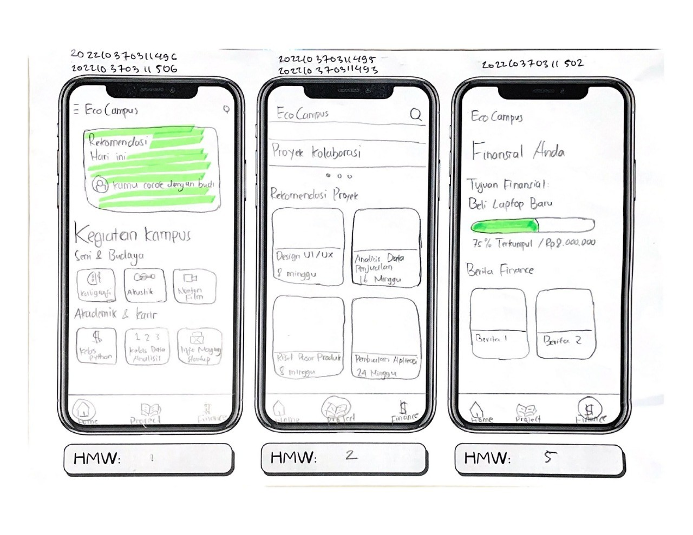
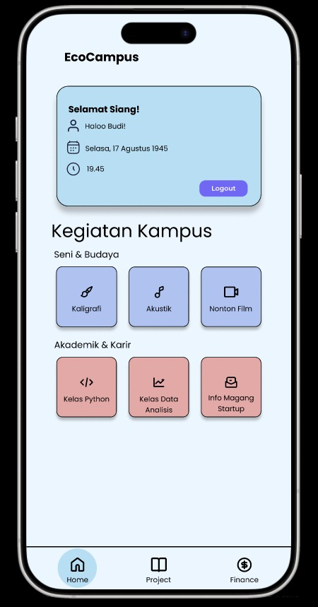
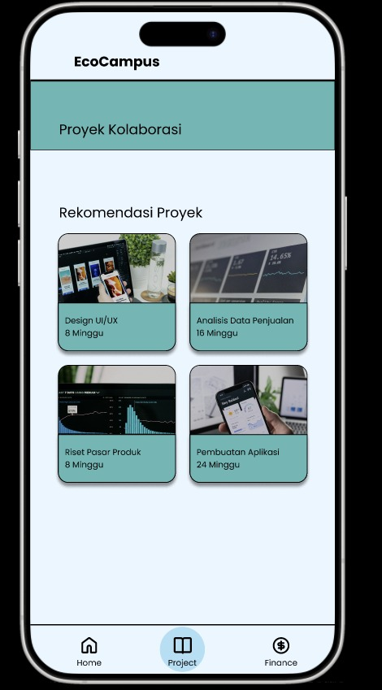

# EcoCampus

## Deskripsi Aplikasi

EcoCampus adalah aplikasi mobile yang dirancang untuk membantu mahasiswa dan civitas kampus membangun relasi, mengikuti kegiatan, serta berpartisipasi aktif dalam berbagai aktivitas positif di lingkungan kampus. Aplikasi ini hadir sebagai solusi berbasis digital untuk meningkatkan keterlibatan mahasiswa dalam kehidupan kampus secara lebih terarah, informatif, dan mudah diakses.

## Kelas-NIM-Nama

1. D - 2022-502 - Iswahyudi              as iswhyd
2. D - 2022-493 - Mada Rabbani S.        as Mada29
3. D - 2022-495 - Naufal Akmal R.        as Naakro
4. D - 2022-496 - Bintangadjie S.B.M.    as Kentangz
5. D - 2022-506 - Amma Rofi'unnajah M.H. as amma1104

## Link Figma

https://www.figma.com/design/tdaV5mlv8N7w6iO8mUnBEX/HMW?node-id=0-1&p=f&t=Sfl1fY3qnE8tS5iT-0

## Worksheet

     
     
     
   

## Low Fidelity Prototype

  

## High Fidelity Prototype

    

## Tabel Pembagian Tugas

  

