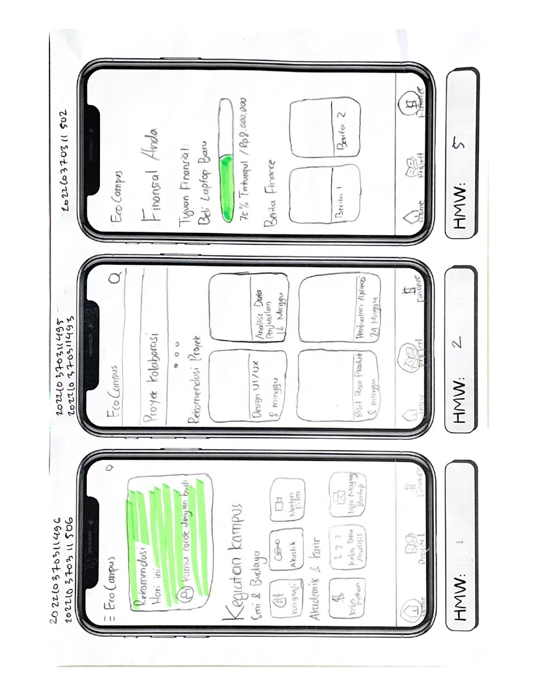

# EcoCampus

EcoCampus adalah aplikasi mobile yang dirancang untuk membantu mahasiswa dan civitas kampus membangun relasi, mengikuti kegiatan, serta berpartisipasi aktif dalam berbagai aktivitas positif di lingkungan kampus. Aplikasi ini hadir sebagai solusi berbasis digital untuk meningkatkan keterlibatan mahasiswa dalam kehidupan kampus secara lebih terarah, informatif, dan mudah diakses.

🎯 Tujuan Aplikasi

EcoCampus bertujuan untuk:

Menjadi wadah bagi mahasiswa untuk memperluas relasi dan komunitas.

Menyediakan informasi kegiatan kampus seperti event, perlombaan, seminar, hingga kegiatan sosial.

Membantu pengguna mengembangkan jejaring dan keterampilan melalui aktivitas yang relevan.

⭐ Fitur Utama

User Profiles
Setiap pengguna dapat membuat profil untuk menampilkan identitas singkat, minat, dan jaringan relasi.

Event & Activities List
Menampilkan daftar kegiatan kampus seperti event akademik, organisasi, volunteer, bursa minat bakat, dan lainnya.

Join & Participate
Pengguna dapat bergabung pada kegiatan sesuai minat secara langsung melalui aplikasi.

Networking & Relasi
Pengguna dapat terhubung dengan mahasiswa lain untuk membangun relasi, bertukar informasi, dan memperluas jaringan.

Notifikasi Real-Time
Sistem notifikasi untuk memberi tahu pengguna tentang event baru, aktivitas yang akan dimulai, update kegiatan, dan lainnya.

🚀 Manfaat

Meningkatkan partisipasi dan keterlibatan mahasiswa dalam kegiatan kampus.

Memudahkan akses informasi acara tanpa harus mencari manual.

Memperluas jaringan pertemanan dengan cara cepat dan modern.

Membantu kampus menciptakan ekosistem digital yang positif dan produktif. 

## Kelas-NIM-Nama-UsernameGithub
1. D, Iswahyudi (2022-502)
2. D, Mada Rabbani S. (2022-493)
3. D, Naufal Akmal R. (2022-495)
4. D, Bintangadjie S.B.M. (2022-496)
5. D, Amma Rofi'unnajah M.H. (2022-506)

## Worksheet

## Low Fidelity Prototype

## Link Figma 
https://www.figma.com/design/tdaV5mlv8N7w6iO8mUnBEX/HMW?node-id=0-1&p=f&t=Sfl1fY3qnE8tS5iT-0
